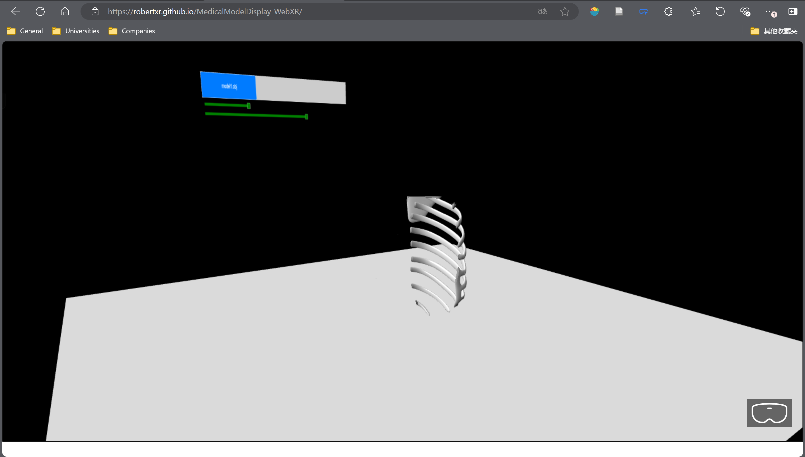
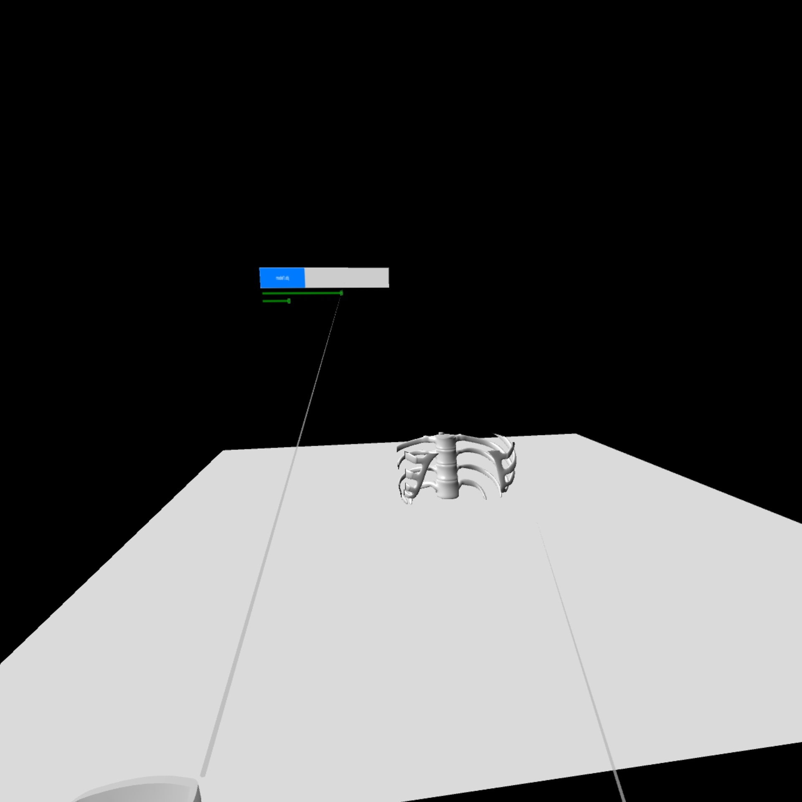
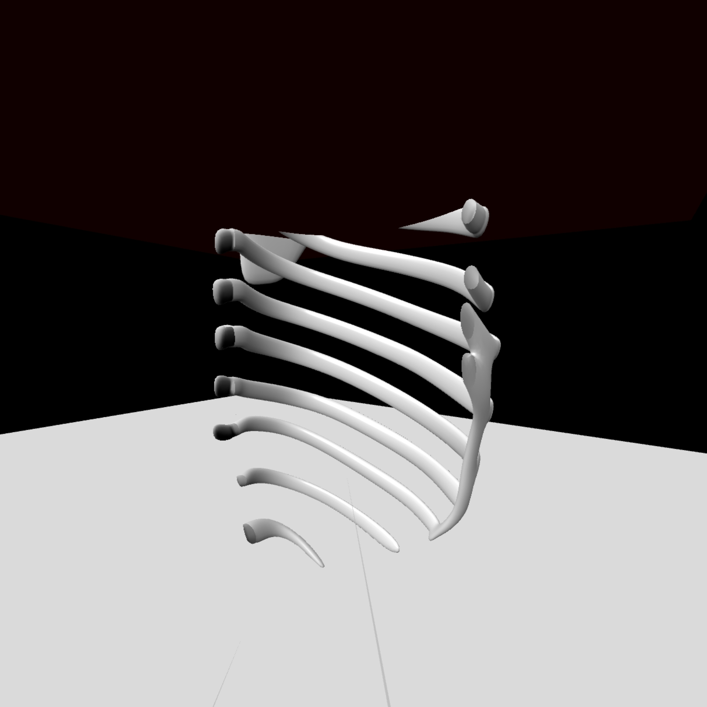

# MedicalModelDisplay-WebXR
The cross-section display of the medical model, implemented by the babylonjs engine, supports WebXR effects for VR/MR/XR Devices.

Website：[Medical Model Display](https://robertxr.github.io/MedicalModelDisplay-WebXR/)

## Functions
1. The model read by keystroke selection
2. The position of the section is controlled by the sliders
3. The VR/MR Device enters the immersive environment via the glasses button on the lower right
4. The VR device can be controlled by the handle knob to move the virtual camera position

## Results
Tested: 
- PC（Edge Browser）
- Phone（Edge Browser）
- Pico(Pico Browser)
- HoloLens 2（Edge Browser）

PC - Edge Browser

VR device - Pico Browser

